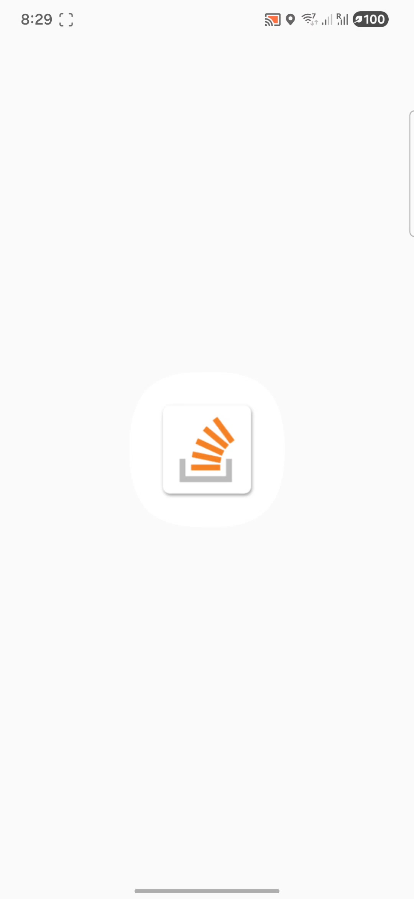
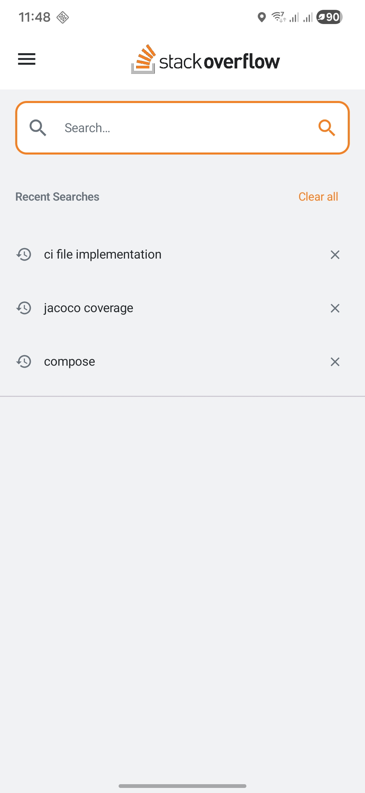
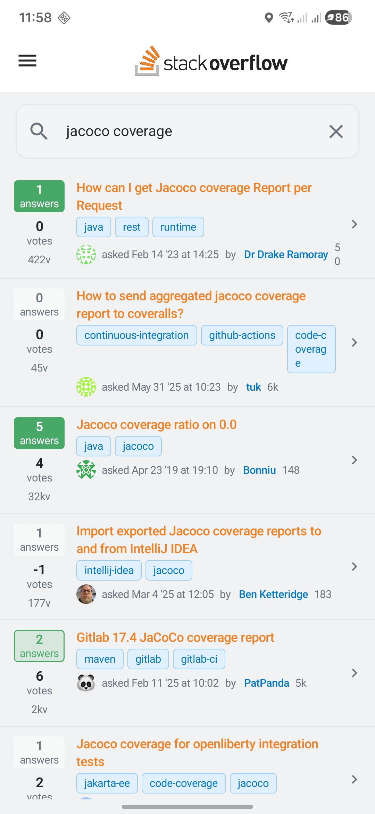
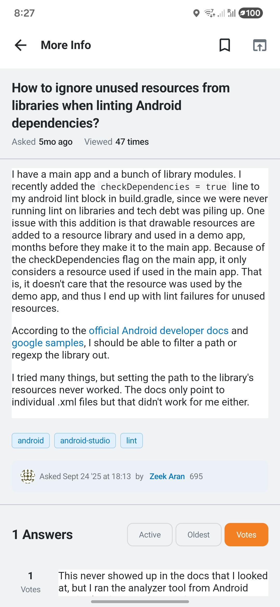
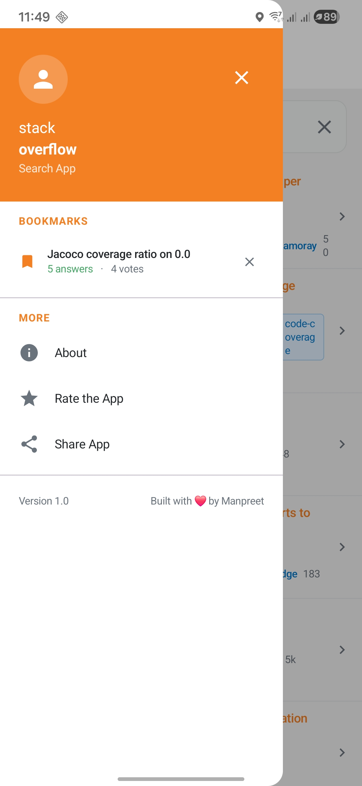

<div align="center">

<br/>

# stack**overflow** Search App

### A production-grade Android application built with Kotlin, Jetpack Compose, and Clean Architecture

<br/>


-F48024?style=flat-square&logo=android&logoColor=white)

<br/>

</div>

---

## What Is This?

A fully-featured Stack Overflow search client that calls the Stack Exchange REST API, renders paginated question results, and displays full question and answer detail with proper HTML rendering — using an embedded `WebView` with dark/light-aware CSS styling.

---

## Features

| | Feature | Detail |
|---|---|---|
| 🔍 | **Real-time search** | Stack Exchange `search/advanced` endpoint, 20 results per page |
| ♾️ | **Infinite scroll** | Auto-load next page when scrolling near the end |
| 📄 | **Full detail view** | Question body + all answers with HTML rendering via WebView |
| 🎨 | **Dark/Light WebView** | CSS colour scheme switches automatically with system theme |
| 🔖 | **Bookmarks** | Save questions locally with Room DB persistence |
| 🕐 | **Recent searches** | Automatically saved; clearable per item or all at once |
| 📡 | **Offline detection** | Custom Compose dialog with retry — checks `NET_CAPABILITY_VALIDATED` |
| 🔄 | **Pull-to-refresh** | Swipe down to reload results |
| 🌙 | **Dark / Light theme** | Full Material 3 with Stack Overflow brand colours |
| 📱 | **Portrait responsive** | Scales across all Android screen sizes, minSdk 26 |

## 📱 Screenshots
<div align="center">

|                       🚀 Launcher                        |                       🔍 Search                        |                   🕐 Recent Searches                   |
|:--------------------------------------------------------:|:------------------------------------------------------:|:------------------------------------------------------:|
|  |  |  |

|                    📋 Search Results                    |                   📄 Question Detail                   |                       📄 Bookmark                        |
|:-------------------------------------------------------:|:------------------------------------------------------:|:--------------------------------------------------------:|
|  |  |  |

</div>
---

## Architecture

```
┌──────────────────────────────────────────────────┐
│                 PRESENTATION LAYER                │
│                                                  │
│   SearchScreen  ·  DetailScreen  ·  Navigation   │
│   SearchViewModel  ·  DetailViewModel            │
│   Theme  ·  CommonComponents (WebView renderer)  │
└────────────────────────┬─────────────────────────┘
                         │  depends on
┌────────────────────────▼─────────────────────────┐
│                   DOMAIN LAYER                    │
│                                                  │
│   Question  ·  Answer  ·  Owner  ·  RecentSearch  │
│   SearchRepository (interface)                   │
│   10 Use Cases  (one business rule each)         │
└────────────────────────┬─────────────────────────┘
                         │  depends on
┌────────────────────────▼─────────────────────────┐
│                    DATA LAYER                     │
│                                                  │
│   SearchRepositoryImpl                           │
│   StackOverflowApi (Retrofit)                    │
│   AppDatabase, RecentSearchDao, BookmarkDao      │
│   DTOs  ·  Mappers  ·  Entities                  │
└──────────────────────────────────────────────────┘
```

**Dependency rule:** Presentation → Domain ← Data. The Domain layer has **zero Android imports** and is testable with plain JVM JUnit.

---

## HTML Rendering — WebView via AndroidView

Question and answer bodies from the Stack Exchange API are HTML strings. The app renders them using Android's `WebView` embedded inside Compose via `AndroidView`.

```kotlin
@SuppressLint("SetJavaScriptEnabled")
@Composable
fun HtmlContent(html: String, modifier: Modifier = Modifier) {
    val isDark = isSystemInDarkTheme()
    val styledHtml = buildHtmlPage(html, isDark)
    AndroidView(
        modifier = modifier.fillMaxWidth(),
        factory = { context ->
            WebView(context).apply {
                webViewClient = WebViewClient()
                settings.javaScriptEnabled = false   // disabled for security
                settings.loadWithOverviewMode = true
                settings.useWideViewPort = true
                isScrollContainer = false             // let LazyColumn handle scroll
                setBackgroundColor(android.graphics.Color.TRANSPARENT)
            }
        },
        update = { webView ->
            webView.loadDataWithBaseURL(null, styledHtml, "text/html", "UTF-8", null)
        }
    )
}
```

**`buildHtmlPage(html, isDark)`** generates a complete HTML document string with an injected `<style>` block — no JavaScript required for dark mode:

```kotlin
private fun buildHtmlPage(html: String, isDark: Boolean): String {
    val bg = if (isDark) "#1B1B1B" else "#FFFFFF"
    val text = if (isDark) "#E4E6E7" else "#232629"
    val codeBg = if (isDark) "#2D2D2D" else "#F6F6F6"
    val link = if (isDark) "#0995DD" else "#0077CC"
    // ... returns full <html><head><style>...</style>...</html>
}
```

**Key configuration choices:**

| Setting | Why |
|---|---|
| `javaScriptEnabled = false` | SO content doesn't need JS; disabled for security |
| `isScrollContainer = false` | Delegates scroll to the enclosing LazyColumn — critical to avoid scroll conflicts |
| `loadDataWithBaseURL(null, ...)` | Loads styled HTML inline without a network request |
| CSS injected in `<style>` block | Dark/light switch without JavaScript — applied at load time |

---

## Project Structure

```
app/src/main/java/com/stackoverflow/search/
│
├── StackOverflowApp.kt          @HiltAndroidApp — DI root
├── MainActivity.kt              @AndroidEntryPoint — single Activity
│
├── core/
│   ├── di/AppModules.kt         NetworkModule · DatabaseModule · RepositoryModule
│   └── utils/
│       ├── Resource.kt          Sealed class: Success / Error / Loading
│       └── NetworkUtils.kt      ConnectivityManager (VALIDATED check) + DateUtils
│
├── data/
│   ├── local/
│   │   ├── dao/Daos.kt          RecentSearchDao (Flow) · BookmarkDao
│   │   ├── database/AppDatabase.kt
│   │   └── entities/
│   │       ├── Entities.kt      RecentSearchEntity · BookmarkEntity
│   │       └── EntityMappers.kt RecentSearchEntity.toDomain()
│   ├── remote/
│   │   ├── api/StackOverflowApi.kt   Retrofit interface (filter=withbody!)
│   │   └── dto/
│   │       ├── StackOverflowDtos.kt  QuestionDto · AnswerDto · OwnerDto
│   │       └── Mappers.kt            DTO ↔ Domain mapping
│   └── repository/SearchRepositoryImpl.kt
│
├── domain/
│   ├── model/Models.kt          Question · Answer · Owner · RecentSearch
│   ├── repository/SearchRepository.kt  (interface)
│   └── usecase/UseCases.kt      10 use cases, one rule each
│
└── presentation/
    ├── common/
    │   └── CommonComponents.kt  Shared Composables incl. HtmlContent (WebView)
    ├── detail/
    │   ├── DetailScreen.kt      Question + answers layout
    │   └── DetailViewModel.kt   SavedStateHandle · answers · sort · bookmark
    ├── navigation/Navigation.kt  NavHost · Screen · NavArgs
    ├── search/
    │   ├── SearchScreen.kt      Search bar · results · recent history
    │   └── SearchViewModel.kt   StateFlow · Job debounce · pagination
    └── theme/
        ├── Theme.kt             Material 3 · SO brand colours
        └── Type.kt              Arial typography scale
```

---

## Key Technical Decisions

### Resource\<T\> — The Result Pattern

```kotlin
sealed class Resource<out T> {
    data class Success<T>(val data: T) : Resource<T>()
    data class Error(val message: String, val throwable: Throwable? = null) : Resource<Nothing>()
    data object Loading : Resource<Nothing>()
}
```

Every async Repository operation returns `Resource<T>`. ViewModels pattern-match exhaustively — the Kotlin compiler enforces handling all three states. No null checks, no uncaught exceptions.

---

### Job Cancellation as Debounce

```kotlin
fun search(query: String) {
    searchJob?.cancel()               // cancel previous search instantly
    searchJob = viewModelScope.launch {
        saveRecentSearchUseCase(query)
        performSearch(query, page = 1, append = false)
    }
}
```

No `delay()`. Cancelling the previous coroutine Job means only the final input ever completes a network request.

---

### Infinite Scroll with `derivedStateOf`

```kotlin
val shouldLoadMore by remember {
    derivedStateOf {
        val lastVisible = listState.layoutInfo.visibleItemsInfo.lastOrNull()?.index ?: 0
        val total = listState.layoutInfo.totalItemsCount
        lastVisible >= total - 3 && total > 0
    }
}

LaunchedEffect(shouldLoadMore) {
    if (shouldLoadMore) viewModel.loadNextPage()
}
```

`derivedStateOf` memoises the threshold computation — only recomposes when the Boolean transitions, not on every scroll frame.

---

### `filter=withbody` — The Non-Obvious API Requirement

```kotlin
@GET("search/advanced")
suspend fun searchQuestions(
    // ...
    @Query("filter") filter: String = "withbody"   // ← required
): SearchResponseDto
```

Without `filter=withbody`, the Stack Exchange API strips all HTML body content. Every `question.body` and `answer.body` would be an empty string, and the WebView renders nothing.

---

### Network Validation Beyond Wi-Fi

```kotlin
fun isNetworkAvailable(): Boolean {
    val capabilities = connectivityManager.getNetworkCapabilities(activeNetwork)
    return capabilities.hasCapability(NET_CAPABILITY_INTERNET) &&
           capabilities.hasCapability(NET_CAPABILITY_VALIDATED)  // ← key check
}
```

`NET_CAPABILITY_VALIDATED` confirms actual internet access — a device on a coffee-shop captive portal passes `INTERNET` but not `VALIDATED`, so all HTTP requests would fail silently without this check.

---

## Tech Stack

| Layer | Library | Version |
|---|---|---|
| Language | Kotlin | 2.0.21 |
| UI | Jetpack Compose + Material 3 | BOM 2024.09.03 |
| HTML Rendering | Android WebView via AndroidView | System WebView |
| Architecture | MVVM + Clean Architecture | — |
| DI | Hilt + KSP | 2.52 |
| Networking | Retrofit + OkHttp + Gson | 2.11.0 / 4.12.0 |
| Local DB | Room | 2.6.1 |
| Images | Coil | 2.7.0 |
| Navigation | Navigation Compose | 2.8.2 |
| Unit Tests | JUnit 4 + MockK + coroutines-test | — |
| UI Tests | Compose UI Test + Hilt Test | — |
| Coverage | JaCoCo | 0.8.12 |

---

## Testing

| File | Tests | Coverage |
|---|:---:|---|
| `SearchViewModelTest` | 16 | search, pagination, recent searches, debounce, refresh |
| `DetailViewModelTest` | 14 | answers, sort orders, bookmark toggle, process death |
| `SearchRepositoryImplTest` | 14 | DTO mapping, offline, dedup, all DAO operations |
| `UseCaseTest` | 10 | blank guard, trim, delegation, error propagation |
| `SearchScreenTest` | 4 | Compose UI — input, text entry, search trigger |
| `DetailScreenTest` | 6 | Compose UI — title, back, bookmark, testTags |
| **Total** | **64** | Unit + Instrumented |

```bash
# Unit tests (no device needed)
./gradlew testDebugUnitTest

# Coverage report → app/build/reports/jacoco/jacocoTestReport/html/
./gradlew jacocoTestReport

# Compose UI tests (device/emulator required)
./gradlew connectedAndroidTest
```

---

## Getting Started

### Prerequisites

- **Android Studio Ladybug** (2024.2.1) or later
- **JDK 17** — bundled with Android Studio
- **Android SDK API 35**
- Device or emulator running **API 26+**

### Setup

```bash
# 1 – Clone
git clone StackOverflowSearchApp.git
cd StackOverflowApp

# 2 – Open in Android Studio: File → Open → select StackOverflowApp folder

# 3 – Sync Gradle (Android Studio will prompt automatically)
#     If prompted about gradle-wrapper.jar, click OK

# 4 – Run
./gradlew assembleDebug
# or Shift+F10 in Android Studio
```

### All Gradle Commands

```bash
./gradlew assembleDebug          # debug APK
./gradlew assembleRelease        # release APK with R8
./gradlew testDebugUnitTest      # unit tests
./gradlew jacocoTestReport       # HTML coverage report
./gradlew connectedAndroidTest   # Compose UI tests (device required)
./gradlew lint                   # static analysis
```

---

## API Reference

Base URL: `https://api.stackexchange.com/2.2/`

```
GET search/advanced
  ?title={query}
  &page={n}
  &pagesize=20
  &order=desc
  &sort=activity
  &site=stackoverflow
  &filter=withbody          ← required: returns HTML body content

GET questions/{questionId}/answers
  ?order=desc
  &sort=activity
  &site=stackoverflow
  &filter=withbody          ← required: returns HTML body content
```

---

## Design System

| Token | Hex | Usage |
|---|---|---|
| `SOrange` | `#F48024` | Primary — buttons, active chips, accents |
| `SBlue` | `#0077CC` | Secondary — links, tag chips |
| `SGreen` | `#48A868` | Accepted answers, success states |
| `SRed` | `#DE4F54` | Errors, downvote indicators |

Full `lightColorScheme` and `darkColorScheme` defined in `Theme.kt`. WebView CSS colours match these tokens via `buildHtmlPage()`.

---

<div align="center">

Built by **Manpreet Singh Mall**

</div>
